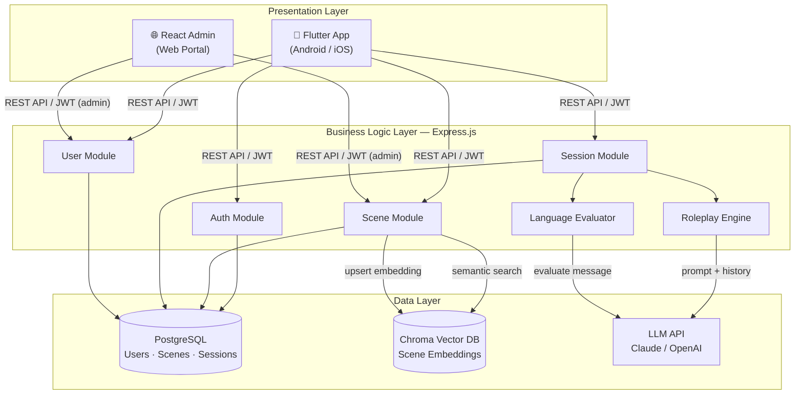
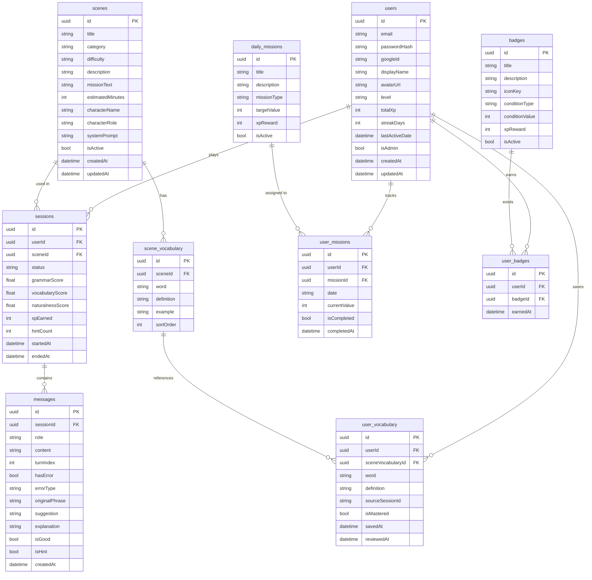
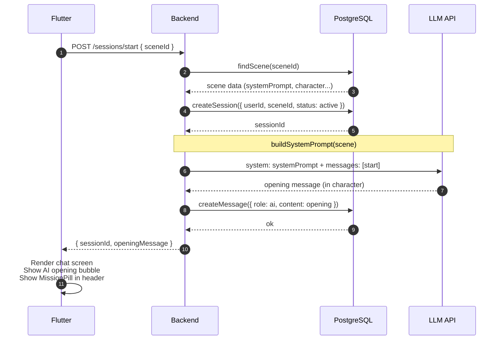
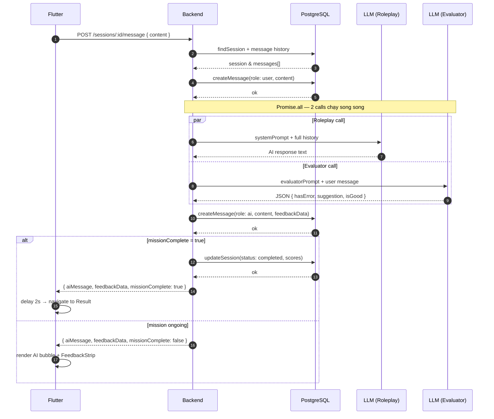
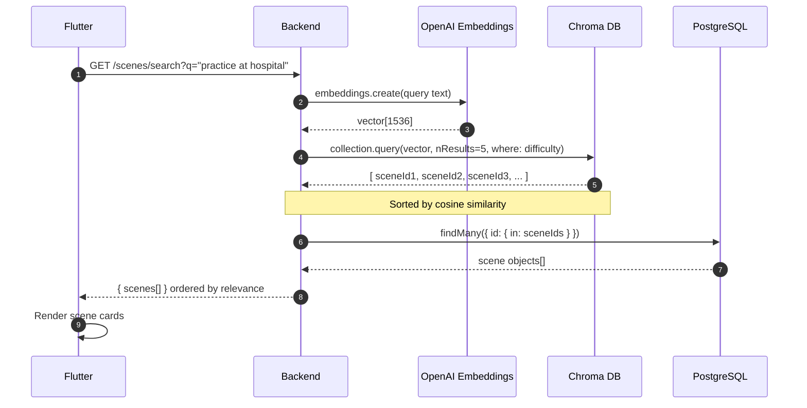
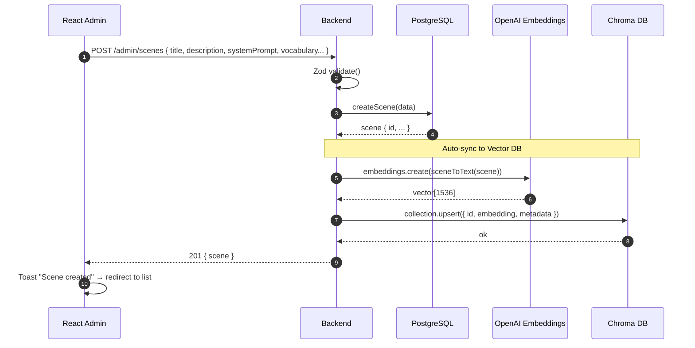
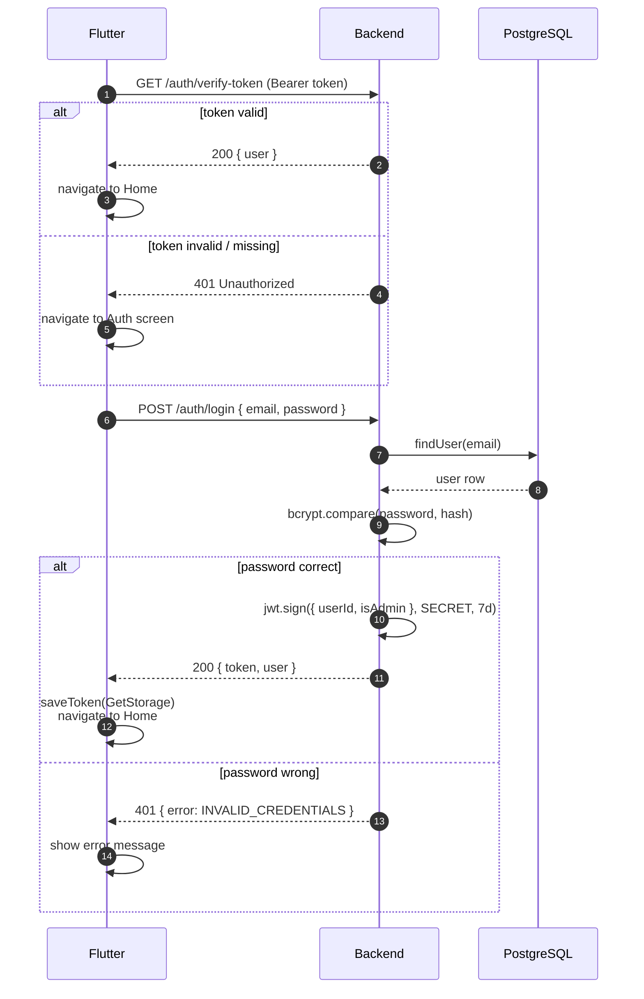
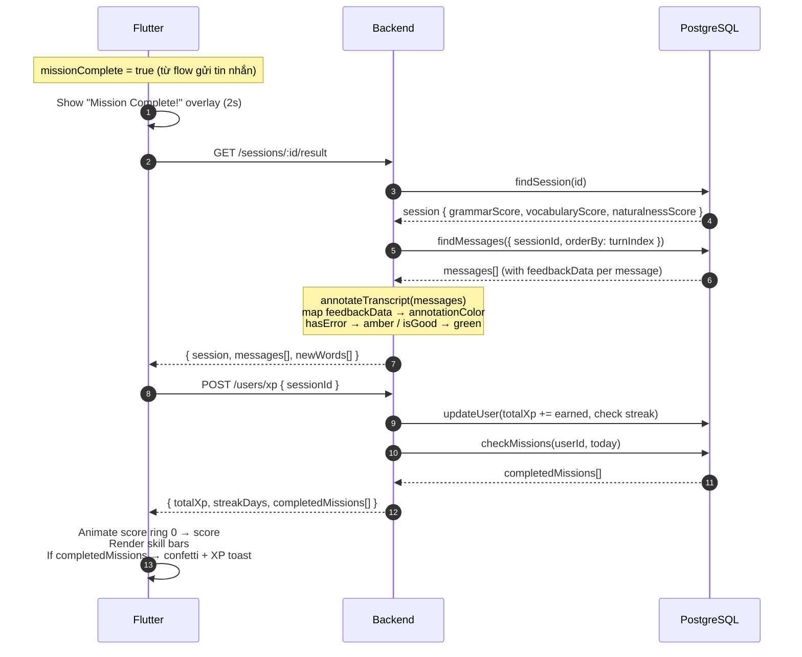
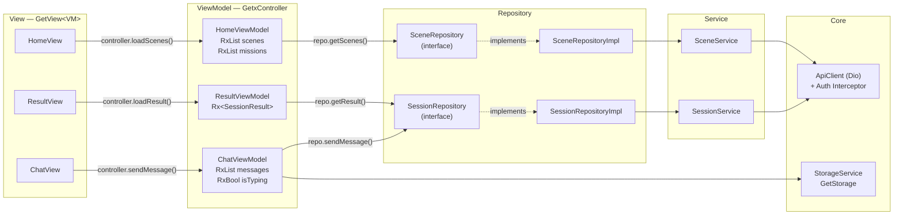
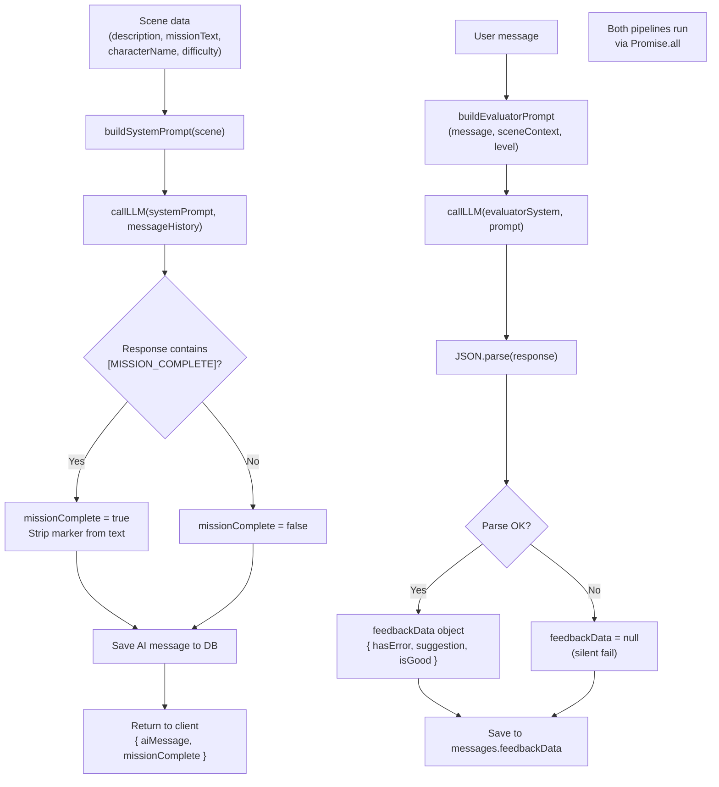

# Scenio — Architecture Diagrams

> Tất cả diagram dùng Mermaid. Render trực tiếp trên GitHub, GitLab, Notion, Obsidian hoặc bất kỳ editor hỗ trợ Mermaid.

---

## 1. System Architecture — 3 tầng

---

## 2. Database ERD

---

## 3. Sequence — Bắt đầu phiên học

---

## 4. Sequence — Gửi tin nhắn (Core Flow)

> Luồng phức tạp nhất: 2 LLM call chạy song song qua `Promise.all`.

---

## 5. Sequence — Tìm kiếm kịch bản (Vector DB)

---

## 6. Sequence — Admin tạo kịch bản

---

## 7. Sequence — Đăng nhập

---

## 8. Sequence — Kết thúc phiên và xem kết quả

---

## 9. Flutter MVVM+GetX — Layer Dependencies

---

## 10. AI Pipeline — Roleplay Engine

---

*Tất cả diagram render bằng Mermaid — compatible với GitHub, GitLab, Notion, Obsidian, VS Code (Markdown Preview Mermaid Support extension).*
