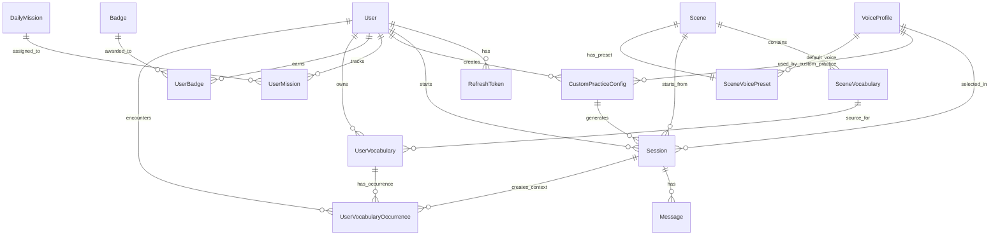

# SCENIO DATABASE ERD EXPLAINED

**Tài liệu giải thích ERD và chi tiết database của Scenio backend**  
**Nguồn sự thật:** `prisma/schema.prisma`  
**Cập nhật theo schema hiện tại:** 2026-04-20

---

## 1. Mục tiêu của tài liệu này

Tài liệu này dùng để:

- giải thích cấu trúc database hiện tại của Scenio
- mô tả quan hệ giữa các bảng
- giải thích ý nghĩa tiếng Việt của từng field
- giúp team mobile, backend và tài liệu đồ án nhìn cùng một mô hình dữ liệu

---

## 2. Tổng quan kiến trúc dữ liệu

Database của Scenio hiện được chia thành các nhóm chính:

- **Auth & User**
  - user, refresh token, onboarding, level test, XP, streak
- **Scenes**
  - scene có sẵn, từ vựng của scene
- **Voice**
  - voice catalog, preset voice cho từng scene, custom practice voice
- **Sessions & Messages**
  - phiên học, transcript, điểm số, realtime voice session
- **Custom Practice**
  - user tự tạo buổi luyện theo mục tiêu thật
- **Missions & Badges**
  - gamification, daily mission, achievement
- **Vocabulary**
  - từ điển tổng hợp của user + occurrence theo từng session

---

## 3. Mermaid ERD

---

## 4. Danh sách model và tên bảng thật trong DB

| Prisma Model | Tên bảng DB |
|---|---|
| `User` | `users` |
| `RefreshToken` | `refresh_tokens` |
| `Scene` | `scenes` |
| `SceneVocabulary` | `scene_vocabulary` |
| `VoiceProfile` | `voice_profiles` |
| `SceneVoicePreset` | `scene_voice_presets` |
| `Session` | `sessions` |
| `CustomPracticeConfig` | `custom_practice_configs` |
| `Message` | `messages` |
| `DailyMission` | `daily_missions` |
| `UserMission` | `user_missions` |
| `Badge` | `badges` |
| `UserBadge` | `user_badges` |
| `UserVocabulary` | `user_vocabulary` |
| `UserVocabularyOccurrence` | `user_vocabulary_occurrences` |

---

## 5. Chi tiết từng bảng

## 5.1. `users`

Lưu thông tin tài khoản, hồ sơ học tập, onboarding, level test, XP và streak.

| Field | Kiểu | Bắt buộc | Giải thích |
|---|---|---:|---|
| `id` | `String` | Có | ID duy nhất của user, sinh tự động bằng `uuid()` |
| `email` | `String` | Có | Email đăng nhập chính của user |
| `password` | `String?` | Không | Mật khẩu đã hash; `null` nếu user đăng nhập Google |
| `googleId` | `String?` | Không | ID Google OAuth; `null` nếu user đăng nhập email/password |
| `displayName` | `String?` | Không | Tên hiển thị của user |
| `avatarUrl` | `String?` | Không | Ảnh đại diện |
| `level` | `Level` | Có | Trình độ hiện tại của user: `A1`, `A2`, `B1`, `B2` |
| `learningGoal` | `String?` | Không | Mục tiêu học chính như `WORK`, `TRAVEL`, `DAILY` |
| `studyFrequency` | `String?` | Không | Tần suất học mà user chọn trong onboarding |
| `selfAssessment` | `String?` | Không | Điểm user tự đánh giá bản thân |
| `needsLevelTest` | `Boolean` | Có | User còn cần làm level test hay không |
| `levelTestedAt` | `DateTime?` | Không | Thời điểm hoàn thành level test |
| `onboardingCompletedAt` | `DateTime?` | Không | Thời điểm hoàn thành onboarding |
| `totalXp` | `Int` | Có | Tổng XP tích lũy |
| `streakDays` | `Int` | Có | Số ngày streak liên tiếp |
| `lastActiveDate` | `DateTime?` | Không | Ngày cuối cùng user active, dùng để tính streak |
| `isAdmin` | `Boolean` | Có | Cờ phân quyền admin |
| `createdAt` | `DateTime` | Có | Thời điểm tạo tài khoản |
| `updatedAt` | `DateTime` | Có | Thời điểm cập nhật gần nhất |

### Quan hệ

- 1 user có nhiều refresh token
- 1 user có nhiều session
- 1 user có nhiều custom practice config
- 1 user có nhiều mission progress
- 1 user có nhiều badge đã nhận
- 1 user có nhiều từ trong dictionary
- 1 user có nhiều vocabulary occurrence

---

## 5.2. `refresh_tokens`

Lưu refresh token để làm mới access token và hỗ trợ logout an toàn.

| Field | Kiểu | Bắt buộc | Giải thích |
|---|---|---:|---|
| `id` | `String` | Có | ID duy nhất của refresh token |
| `token` | `String` | Có | Giá trị refresh token, unique |
| `userId` | `String` | Có | FK trỏ tới `users.id` |
| `expiresAt` | `DateTime` | Có | Thời điểm hết hạn |
| `createdAt` | `DateTime` | Có | Thời điểm tạo refresh token |

---

## 5.3. `scenes`

Lưu các scene có sẵn trong thư viện học tập của Scenio.

| Field | Kiểu | Bắt buộc | Giải thích |
|---|---|---:|---|
| `id` | `String` | Có | ID duy nhất của scene |
| `title` | `String` | Có | Tên scene |
| `category` | `SceneCategory` | Có | Nhóm scene: `WORK`, `TRAVEL`, `DAILY`, `SOCIAL` |
| `description` | `String` | Có | Mô tả ngắn cho scene |
| `missionText` | `String` | Có | Mục tiêu hội thoại mà user cần hoàn thành |
| `difficulty` | `Level` | Có | Độ khó của scene |
| `estimatedMinutes` | `Int` | Có | Thời lượng dự kiến của buổi luyện |
| `characterName` | `String` | Có | Tên nhân vật AI trong scene |
| `characterRole` | `String` | Có | Vai trò nhân vật AI trong scene |
| `systemPrompt` | `String` | Có | Prompt nền cho AI roleplay trong scene |
| `isActive` | `Boolean` | Có | Scene có đang active để hiển thị cho user hay không |
| `createdAt` | `DateTime` | Có | Ngày tạo |
| `updatedAt` | `DateTime` | Có | Ngày cập nhật |

### Quan hệ

- 1 scene có nhiều từ vựng scene
- 1 scene có nhiều session
- 1 scene có tối đa 1 record voice preset

---

## 5.4. `scene_vocabulary`

Lưu bộ từ vựng gốc của từng scene.

| Field | Kiểu | Bắt buộc | Giải thích |
|---|---|---:|---|
| `id` | `String` | Có | ID của từ vựng trong scene |
| `sceneId` | `String` | Có | FK tới `scenes.id` |
| `word` | `String` | Có | Từ hoặc cụm từ |
| `definition` | `String` | Có | Nghĩa của từ |
| `example` | `String` | Có | Ví dụ sử dụng |
| `sortOrder` | `Int` | Có | Thứ tự hiển thị trong scene detail |

### Quan hệ

- nhiều `scene_vocabulary` thuộc về 1 `scene`
- 1 `scene_vocabulary` có thể là nguồn gốc của nhiều `user_vocabulary`

---

## 5.5. `voice_profiles`

Lưu catalog voice dùng cho preview, realtime voice, scene preset và custom practice.

| Field | Kiểu | Bắt buộc | Giải thích |
|---|---|---:|---|
| `id` | `String` | Có | ID voice profile |
| `displayName` | `String` | Có | Tên hiển thị của voice |
| `description` | `String?` | Không | Mô tả ngắn về giọng |
| `gender` | `VoiceGender` | Có | Giới tính thể hiện của giọng: `MALE`, `FEMALE`, `NEUTRAL` |
| `locale` | `String?` | Không | Locale của voice, ví dụ `en-US` |
| `accent` | `String?` | Không | Accent, ví dụ `American`, `British` |
| `provider` | `VoiceProvider` | Có | Provider dùng cho TTS preview |
| `providerVoiceId` | `String?` | Không | Voice ID của provider TTS |
| `realtimeProvider` | `VoiceProvider` | Có | Provider dùng cho realtime voice |
| `realtimeVoiceId` | `String?` | Không | Voice ID dùng cho realtime |
| `styleTags` | `String[]` | Có | Tag mô tả style voice |
| `sampleText` | `String?` | Không | Text mẫu để preview |
| `sampleUrl` | `String?` | Không | URL file preview nếu có |
| `latencyTier` | `String?` | Không | Nhóm latency mong muốn của voice |
| `isActive` | `Boolean` | Có | Voice có đang mở cho hệ thống dùng hay không |
| `createdAt` | `DateTime` | Có | Ngày tạo |
| `updatedAt` | `DateTime` | Có | Ngày cập nhật |

### Quan hệ

- 1 voice có thể được chọn trong nhiều session
- 1 voice có thể được dùng trong nhiều custom practice config
- 1 voice có thể làm default preset cho nhiều scene

---

## 5.6. `scene_voice_presets`

Lưu preset voice mặc định cho từng scene.

| Field | Kiểu | Bắt buộc | Giải thích |
|---|---|---:|---|
| `id` | `String` | Có | ID của preset record |
| `sceneId` | `String` | Có | FK tới `scenes.id`, unique vì mỗi scene chỉ có 1 preset record |
| `defaultVoiceId` | `String?` | Không | Voice mặc định chung |
| `defaultMaleVoiceId` | `String?` | Không | Voice nam mặc định |
| `defaultFemaleVoiceId` | `String?` | Không | Voice nữ mặc định |
| `createdAt` | `DateTime` | Có | Ngày tạo |
| `updatedAt` | `DateTime` | Có | Ngày cập nhật |

---

## 5.7. `sessions`

Đây là bảng trung tâm của Scenio. Mỗi bản ghi là một lần user luyện tập thật.

| Field | Kiểu | Bắt buộc | Giải thích |
|---|---|---:|---|
| `id` | `String` | Có | ID session |
| `userId` | `String` | Có | FK tới user tạo session |
| `sceneId` | `String?` | Không | FK tới scene nếu session đến từ scene có sẵn |
| `customPracticeConfigId` | `String?` | Không | FK tới custom practice config nếu session là custom |
| `sourceType` | `SessionSourceType` | Có | Nguồn tạo session: `CURATED_SCENE` hoặc `CUSTOM_PRACTICE` |
| `voiceProfileId` | `String?` | Không | Voice profile được chọn cho session |
| `voiceProvider` | `VoiceProvider?` | Không | Provider voice đang dùng cho session |
| `voiceSnapshotName` | `String?` | Không | Tên voice được chụp snapshot tại thời điểm tạo session |
| `providerSessionId` | `String?` | Không | ID session từ provider realtime bên ngoài |
| `modality` | `SessionModality` | Có | `TEXT` hoặc `VOICE` |
| `status` | `SessionStatus` | Có | Trạng thái: `ACTIVE`, `COMPLETED`, `ABANDONED` |
| `grammarScore` | `Float?` | Không | Điểm grammar cuối session |
| `vocabularyScore` | `Float?` | Không | Điểm vocabulary cuối session |
| `naturalnessScore` | `Float?` | Không | Điểm naturalness cuối session |
| `xpEarned` | `Int` | Có | Số XP session này đáng được nhận |
| `xpGrantedAt` | `DateTime?` | Không | Thời điểm XP đã được grant vào user profile |
| `hintCount` | `Int` | Có | Số hint user đã dùng trong session |
| `startedAt` | `DateTime` | Có | Thời điểm bắt đầu |
| `endedAt` | `DateTime?` | Không | Thời điểm kết thúc hoặc abandon |

### Quan hệ

- 1 session thuộc về 1 user
- 1 session có thể thuộc 1 scene hoặc 1 custom practice config
- 1 session có nhiều message
- 1 session có thể tạo nhiều vocabulary occurrence

---

## 5.8. `custom_practice_configs`

Lưu structured brief và config đầy đủ cho tính năng `Custom Practice Session`.

| Field | Kiểu | Bắt buộc | Giải thích |
|---|---|---:|---|
| `id` | `String` | Có | ID custom practice config |
| `userId` | `String` | Có | User tạo config này |
| `practiceGoal` | `String` | Có | Mục tiêu tổng thể của buổi luyện |
| `successOutcome` | `String?` | Không | Kết quả mong muốn sau buổi luyện |
| `topicSummary` | `String` | Có | Tóm tắt ngắn về tình huống |
| `contextType` | `String` | Có | Loại bối cảnh như `INTERVIEW`, `PHONE_CALL`, `WORK` |
| `location` | `String?` | Không | Nơi diễn ra hội thoại |
| `conversationChannel` | `String` | Có | Kiểu kênh giao tiếp: gặp trực tiếp, gọi điện, video call |
| `timePressure` | `String?` | Không | Áp lực thời gian của tình huống |
| `specialConditions` | `String[]` | Có | Các điều kiện đặc biệt của buổi luyện |
| `userRole` | `String` | Có | Vai trò của learner trong hội thoại |
| `userIntent` | `String?` | Không | Ý định chính mà learner muốn đạt |
| `userEnglishLevel` | `Level?` | Không | Level learner mong muốn hệ thống bám theo |
| `userPersonaNotes` | `String?` | Không | Ghi chú thêm về learner |
| `aiRole` | `String` | Có | Vai trò của AI |
| `aiDisplayName` | `String` | Có | Tên hiển thị của AI |
| `aiRelationshipToUser` | `String?` | Không | Quan hệ giữa AI và learner |
| `aiPrimaryGoal` | `String?` | Không | Mục tiêu của nhân vật AI trong hội thoại |
| `aiBehaviorStyle` | `String?` | Không | Phong cách hành xử của AI |
| `aiGenderPresentation` | `VoiceGender` | Có | Giới tính thể hiện của AI |
| `aiVoicePresetId` | `String?` | Không | Voice preset chọn trước nếu có |
| `aiVoiceTone` | `String?` | Không | Tone mong muốn của giọng AI |
| `aiSpeechSpeed` | `String?` | Không | Tốc độ nói mong muốn |
| `aiAccentPreference` | `String?` | Không | Accent mong muốn |
| `difficulty` | `Level` | Có | Độ khó của custom session |
| `conversationLength` | `String?` | Không | Độ dài buổi luyện |
| `correctionStyle` | `String?` | Không | Kiểu sửa lỗi |
| `hintFrequency` | `String?` | Không | Tần suất hint mong muốn |
| `responseComplexity` | `String?` | Không | Mức phức tạp câu trả lời AI |
| `focusSkills` | `String[]` | Có | Danh sách kỹ năng muốn tập trung |
| `mustUseVocabulary` | `String[]` | Có | Từ/cụm từ bắt buộc nên xuất hiện |
| `avoidTopics` | `String[]` | Có | Chủ đề không muốn chạm tới |
| `customInstructions` | `String?` | Không | Ghi chú tự do thêm cho hệ thống |
| `displayTitle` | `String` | Có | Tiêu đề hiển thị rút gọn cho UI |
| `displaySubtitle` | `String` | Có | Subtitle hiển thị cho UI |
| `missionText` | `String` | Có | Mục tiêu hành động của session |
| `estimatedMinutes` | `Int` | Có | Thời lượng ước tính |
| `openingMessage` | `String` | Có | Opening message deterministic để mở màn session |
| `systemPrompt` | `String` | Có | Prompt nền đã chuẩn hóa cho custom session |
| `createdAt` | `DateTime` | Có | Ngày tạo |
| `updatedAt` | `DateTime` | Có | Ngày cập nhật |

### Quan hệ

- 1 custom practice config thuộc 1 user
- 1 custom practice config có thể sinh ra nhiều session
- 1 config có thể gắn với 1 voice preset

---

## 5.9. `messages`

Lưu transcript và feedback từng turn trong một session.

| Field | Kiểu | Bắt buộc | Giải thích |
|---|---|---:|---|
| `id` | `String` | Có | ID message |
| `sessionId` | `String` | Có | FK tới session |
| `role` | `MessageRole` | Có | `USER` hoặc `AI` |
| `content` | `String` | Có | Nội dung text hoặc transcript |
| `turnIndex` | `Int` | Có | Thứ tự turn trong session |
| `providerEventId` | `String?` | Không | ID event từ provider realtime để idempotency |
| `modality` | `MessageModality` | Có | `TEXT` hoặc `AUDIO_TRANSCRIPT` |
| `audioStartMs` | `Int?` | Không | Thời điểm bắt đầu audio trong stream |
| `audioEndMs` | `Int?` | Không | Thời điểm kết thúc audio trong stream |
| `isFinal` | `Boolean` | Có | Message đã finalized hay còn partial |
| `hasError` | `Boolean?` | Không | Turn này có lỗi ngôn ngữ hay không |
| `errorType` | `ErrorType?` | Không | Loại lỗi: grammar, vocabulary, naturalness |
| `originalPhrase` | `String?` | Không | Câu gốc user nói |
| `suggestion` | `String?` | Không | Gợi ý sửa |
| `explanation` | `String?` | Không | Giải thích ngắn bằng tiếng Việt |
| `isGood` | `Boolean?` | Không | Cờ cho biết câu này tốt |
| `isHint` | `Boolean` | Có | Đây có phải message hint hay không |
| `createdAt` | `DateTime` | Có | Thời điểm tạo message |

---

## 5.10. `daily_missions`

Định nghĩa mission gốc của hệ thống.

| Field | Kiểu | Bắt buộc | Giải thích |
|---|---|---:|---|
| `id` | `String` | Có | ID mission |
| `title` | `String` | Có | Tiêu đề mission |
| `description` | `String` | Có | Mô tả mission |
| `missionType` | `MissionType` | Có | Loại mission |
| `targetValue` | `Int` | Có | Ngưỡng cần đạt |
| `xpReward` | `Int` | Có | XP thưởng khi complete |
| `isActive` | `Boolean` | Có | Mission còn active hay không |

---

## 5.11. `user_missions`

Lưu tiến độ mission hằng ngày của từng user.

| Field | Kiểu | Bắt buộc | Giải thích |
|---|---|---:|---|
| `id` | `String` | Có | ID progress record |
| `userId` | `String` | Có | User sở hữu mission progress |
| `missionId` | `String` | Có | FK tới daily mission |
| `date` | `String` | Có | Ngày dạng `YYYY-MM-DD` |
| `currentValue` | `Int` | Có | Tiến độ hiện tại |
| `isCompleted` | `Boolean` | Có | Đã hoàn thành chưa |
| `completedAt` | `DateTime?` | Không | Thời điểm hoàn thành |

---

## 5.12. `badges`

Định nghĩa badge/achievement gốc của hệ thống.

| Field | Kiểu | Bắt buộc | Giải thích |
|---|---|---:|---|
| `id` | `String` | Có | ID badge |
| `title` | `String` | Có | Tên badge |
| `description` | `String` | Có | Mô tả badge |
| `iconKey` | `String` | Có | Khóa icon để mobile map sang UI |
| `conditionType` | `ConditionType` | Có | Loại điều kiện để đạt badge |
| `conditionValue` | `Int` | Có | Ngưỡng điều kiện |
| `xpReward` | `Int` | Có | XP thưởng |
| `isActive` | `Boolean` | Có | Badge có đang active không |

---

## 5.13. `user_badges`

Lưu badge mà user đã nhận.

| Field | Kiểu | Bắt buộc | Giải thích |
|---|---|---:|---|
| `id` | `String` | Có | ID record |
| `userId` | `String` | Có | FK tới user |
| `badgeId` | `String` | Có | FK tới badge |
| `earnedAt` | `DateTime` | Có | Thời điểm user nhận badge |

---

## 5.14. `user_vocabulary`

Đây là **dictionary tổng hợp** của user.

Một từ chỉ có **một bản ghi tổng hợp** cho mỗi user, unique theo `userId + normalizedWord`.

| Field | Kiểu | Bắt buộc | Giải thích |
|---|---|---:|---|
| `id` | `String` | Có | ID dictionary entry |
| `userId` | `String` | Có | User sở hữu từ này |
| `sceneVocabularyId` | `String?` | Không | Nếu từ đến từ scene vocabulary gốc thì trỏ về đây |
| `normalizedWord` | `String` | Có | Phiên bản chuẩn hóa để chống trùng |
| `word` | `String` | Có | Từ/cụm từ hiển thị |
| `definition` | `String` | Có | Nghĩa của từ |
| `sourceSessionId` | `String?` | Không | Session gần nhất mà user gặp/lưu từ này |
| `encounterCount` | `Int` | Có | Số lần từ này đã được gặp trong hệ thống |
| `srsLevel` | `Int` | Có | Cấp độ SRS hiện tại |
| `nextReviewAt` | `DateTime?` | Không | Lịch ôn tiếp theo |
| `isMastered` | `Boolean` | Có | User đã thuộc từ này chưa |
| `savedAt` | `DateTime` | Có | Lần đầu lưu từ |
| `lastSeenAt` | `DateTime` | Có | Lần gặp gần nhất |
| `reviewedAt` | `DateTime?` | Không | Lần review gần nhất |

### Quan hệ

- 1 user có nhiều dictionary entries
- 1 dictionary entry có nhiều occurrence
- 1 dictionary entry có thể bắt nguồn từ 1 `scene_vocabulary`

---

## 5.15. `user_vocabulary_occurrences`

Đây là bảng lưu **mỗi lần gặp lại từ theo từng session**.

| Field | Kiểu | Bắt buộc | Giải thích |
|---|---|---:|---|
| `id` | `String` | Có | ID occurrence |
| `userVocabularyId` | `String` | Có | FK tới dictionary entry tổng hợp |
| `userId` | `String` | Có | FK tới user |
| `sessionId` | `String?` | Không | Session nơi từ này xuất hiện |
| `sampleSentence` | `String?` | Không | Câu ví dụ hoặc câu user/AI đã nói trong context đó |
| `sourceMessageId` | `String?` | Không | ID message gốc nếu muốn trace lại transcript |
| `createdAt` | `DateTime` | Có | Thời điểm occurrence được tạo |

### Quy tắc quan trọng

- unique theo `userVocabularyId + sessionId`
- nghĩa là cùng một từ chỉ có tối đa một occurrence cho mỗi session

---

## 6. Giải thích các enum

## 6.1. `Level`

| Giá trị | Ý nghĩa |
|---|---|
| `A1` | Cơ bản |
| `A2` | Sơ trung cấp |
| `B1` | Trung cấp |
| `B2` | Trung cao cấp |

## 6.2. `SceneCategory`

| Giá trị | Ý nghĩa |
|---|---|
| `WORK` | Giao tiếp công việc |
| `TRAVEL` | Giao tiếp du lịch |
| `DAILY` | Giao tiếp hằng ngày |
| `SOCIAL` | Giao tiếp xã hội, trò chuyện |

## 6.3. `SessionStatus`

| Giá trị | Ý nghĩa |
|---|---|
| `ACTIVE` | Session đang diễn ra |
| `COMPLETED` | Session đã hoàn thành |
| `ABANDONED` | Session bị thoát giữa chừng |

## 6.4. `SessionModality`

| Giá trị | Ý nghĩa |
|---|---|
| `TEXT` | Luyện bằng text |
| `VOICE` | Luyện bằng voice |

## 6.5. `SessionSourceType`

| Giá trị | Ý nghĩa |
|---|---|
| `CURATED_SCENE` | Session được tạo từ scene có sẵn |
| `CUSTOM_PRACTICE` | Session được tạo từ custom practice brief |

## 6.6. `MessageRole`

| Giá trị | Ý nghĩa |
|---|---|
| `USER` | Tin nhắn của learner |
| `AI` | Tin nhắn của AI |

## 6.7. `MessageModality`

| Giá trị | Ý nghĩa |
|---|---|
| `TEXT` | Tin nhắn text thường |
| `AUDIO_TRANSCRIPT` | Transcript được sinh ra từ audio |

## 6.8. `VoiceProvider`

| Giá trị | Ý nghĩa |
|---|---|
| `ELEVENLABS` | Dùng ElevenLabs |
| `OPENAI` | Dùng OpenAI |

## 6.9. `VoiceGender`

| Giá trị | Ý nghĩa |
|---|---|
| `MALE` | Giọng/nhân vật nam |
| `FEMALE` | Giọng/nhân vật nữ |
| `NEUTRAL` | Trung tính |

## 6.10. `ErrorType`

| Giá trị | Ý nghĩa |
|---|---|
| `GRAMMAR` | Lỗi ngữ pháp |
| `NATURALNESS` | Câu chưa tự nhiên |
| `VOCABULARY` | Vấn đề về từ vựng |

## 6.11. `MissionType`

| Giá trị | Ý nghĩa |
|---|---|
| `COMPLETE_SCENE` | Hoàn thành số lượng session/scene yêu cầu |
| `ACHIEVE_SCORE` | Đạt điểm số tối thiểu |
| `MAINTAIN_STREAK` | Giữ streak liên tục |
| `SAVE_VOCABULARY` | Lưu từ vựng mới |

## 6.12. `ConditionType`

| Giá trị | Ý nghĩa |
|---|---|
| `SCENES_COMPLETED` | Hoàn thành đủ số scene/session |
| `STREAK_DAYS` | Đạt streak đủ số ngày |
| `HIGH_SCORE` | Từng đạt điểm cao |
| `VOCAB_SAVED` | Đã lưu đủ số lượng từ |
| `FIRST_SESSION` | Hoàn thành session đầu tiên |
| `PERFECT_SCORE` | Đạt điểm tuyệt đối |

---

## 7. Quan hệ nghiệp vụ quan trọng cần nhớ

### 7.1. User và Session

- một user có thể có nhiều session theo thời gian
- nhưng ở tầng business hiện tại, backend chỉ cho phép tối đa **một session `ACTIVE`**

### 7.2. Session và nguồn tạo session

- nếu `sourceType = CURATED_SCENE` thì session thường có `sceneId`
- nếu `sourceType = CUSTOM_PRACTICE` thì session thường có `customPracticeConfigId`

### 7.3. Vocabulary

- `user_vocabulary` là lớp dictionary tổng hợp
- `user_vocabulary_occurrences` là lớp history/context theo session
- SRS gắn ở tầng dictionary, không gắn ở từng occurrence

### 7.4. Voice

- `voice_profiles` là catalog voice dùng chung
- `scene_voice_presets` dùng để chọn nhanh voice phù hợp cho scene
- `custom_practice_configs.aiVoicePresetId` cho phép custom practice chọn persona/voice cụ thể

---

## 8. Kết luận ngắn

Schema hiện tại của Scenio đã hỗ trợ:

- thư viện scene có sẵn
- custom practice session
- realtime/text session
- transcript chi tiết
- gamification
- dictionary tổng hợp + deck theo ngữ cảnh

Nói cách khác, database này không chỉ phục vụ CRUD đơn giản, mà đã là nền cho:

- học theo kịch bản
- học theo mục tiêu cá nhân
- voice AI
- progress tracking
- vocabulary learning dài hạn
