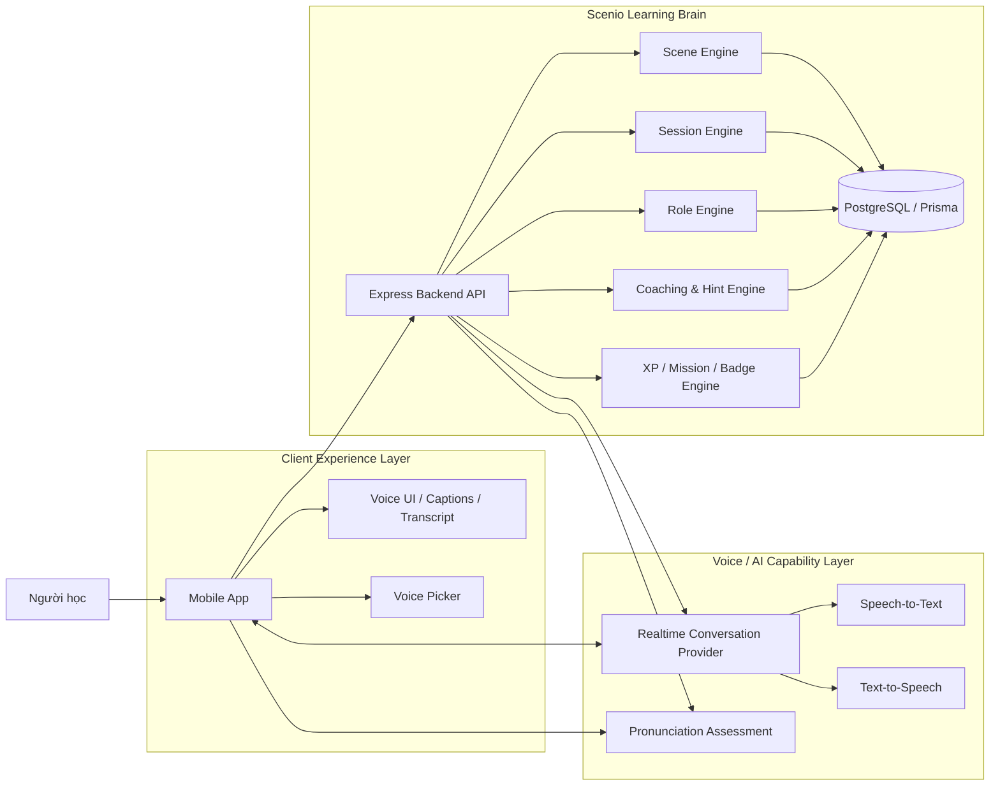
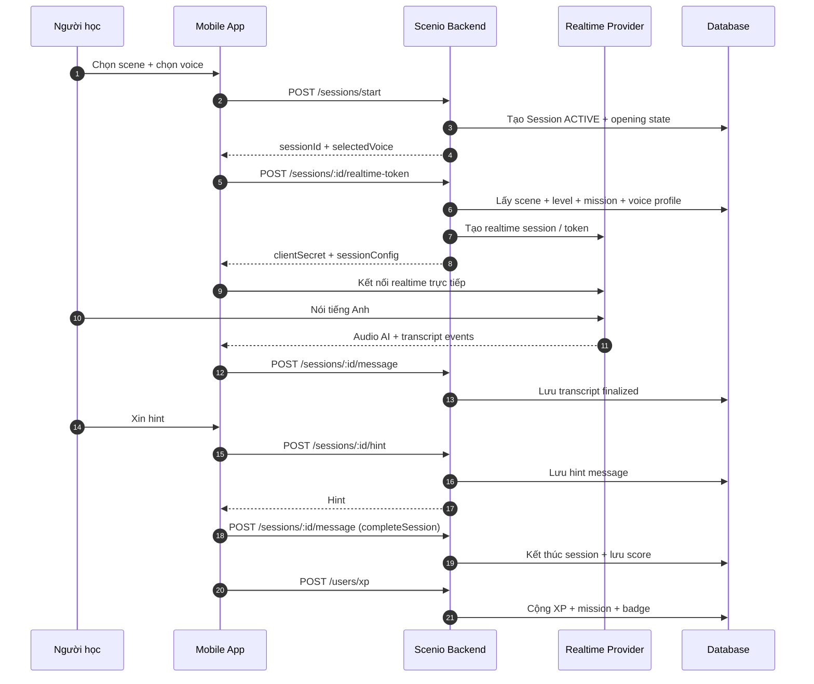
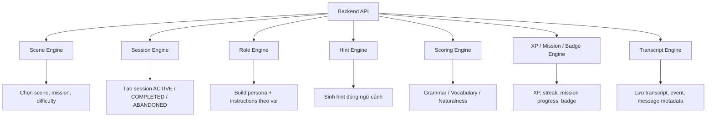

# Scenio - Kiến Trúc Voice Conversation Ở Mức High-Level

> Cập nhật: 2026-04-15
> Phạm vi: Mô tả kiến trúc tổng thể cho chức năng học giao tiếp theo ngữ cảnh bằng voice realtime

## 1. Bối cảnh bài toán

Scenio không chỉ là một app chat với AI.

Scenio là một hệ thống học giao tiếp tiếng Anh theo ngữ cảnh, nên AI cần:

- vào đúng vai trong từng `scene`
- giữ đúng persona và thái độ của nhân vật
- phản hồi phù hợp với `level` của người học
- giúp người học hoàn thành `mission`
- vẫn cho backend chấm điểm, cộng XP, theo dõi tiến độ, và game hóa

Vì vậy, kiến trúc không nên chỉ tối ưu cho chuyện "phát ra âm thanh".
Kiến trúc cần ưu tiên:

- trải nghiệm đối thoại giống người thật
- độ bám vai theo ngữ cảnh
- khả năng kiểm soát learning flow của Scenio
- khả năng thay provider voice/LLM sau này

---

## 2. Nguyên tắc thiết kế

### 2.1. Scenio phải sở hữu "learning brain"

Phần giá trị cốt lõi của Scenio không nằm ở TTS hay STT thuần túy.
Giá trị cốt lõi nằm ở:

- `scene engine`
- `role engine`
- `session engine`
- `coaching / hint engine`
- `scoring / XP / mission engine`

Điều đó có nghĩa:

- provider không được nắm business logic chính của bài học
- transcript, kết quả, scoring, mission completion phải quay về backend Scenio
- `scene` và `session` là source of truth của toàn bộ flow

### 2.2. Provider chỉ nên là capability layer

Provider bên ngoài nên đóng vai trò:

- nhận audio từ client
- chuyển speech thành text
- sinh câu trả lời
- phát audio ngược lại

Nhưng logic học tập vẫn phải nằm ở backend của Scenio.

### 2.3. Kiến trúc phải thay provider được

Ở giai đoạn đầu, team có thể dùng:

- OpenAI Realtime
- ElevenLabs Agents
- hoặc phối hợp nhiều provider

Nhưng API nội bộ của backend nên giữ ổn định để mobile không phải đổi quá nhiều khi mình thay vendor.

---

## 3. Tư duy kiến trúc tổng thể

Scenio nên được chia làm 3 lớp:

1. `Client Experience Layer`
   - mobile app
   - voice UI
   - realtime captions
   - voice picker

2. `Scenio Learning Brain`
   - scene/session state
   - role instructions
   - transcript persistence
   - hint
   - scoring
   - XP, badges, missions

3. `Voice / AI Capability Layer`
   - realtime speech conversation
   - STT
   - TTS
   - optional pronunciation assessment

---

## 4. Sơ đồ high-level



---

## 5. Ranh giới trách nhiệm

### 5.1. Mobile app chịu trách nhiệm gì

- hiển thị scene detail
- cho user chọn voice/persona
- bắt đầu session
- gọi endpoint lấy realtime token hoặc agent session
- mở micro
- phát audio AI trả về
- hiển thị caption/transcript realtime
- gửi finalized transcript về backend

### 5.2. Backend Scenio chịu trách nhiệm gì

- xác thực người dùng
- kiểm tra quyền sở hữu session
- chọn đúng `scene`
- resolve `voiceProfile`
- build instructions theo ngữ cảnh
- lưu transcript/messages
- cấp hint
- kết thúc session
- tính điểm, XP, mission progress

### 5.3. Provider voice/LLM chịu trách nhiệm gì

- xử lý speech/audio ở mức realtime
- STT
- TTS
- phản hồi hội thoại

Provider không nên là nơi giữ:

- nguồn sự thật của session
- XP
- mission completion
- badge
- analytics học tập

---

## 6. Luồng chính của một phiên học voice



---

## 7. Kiến trúc provider abstraction

Để không bị khóa cứng vào một vendor, backend nên có một abstraction nội bộ.

Ví dụ:

```text
VoiceConversationProvider
  - createRealtimeSession()
  - previewVoice()
  - normalizeTranscriptEvent()

VoiceSynthesisProvider
  - synthesizePreview()

PronunciationProvider
  - assessPronunciation()
```

Sau đó mỗi vendor chỉ là một adapter:

- `OpenAIRealtimeProvider`
- `ElevenAgentsProvider`
- `ElevenTTSProvider`
- `AzurePronunciationProvider`

### Lợi ích

- mobile không cần biết vendor cụ thể
- backend vẫn giữ contract ổn định
- dễ đổi hướng sau khi benchmark latency/cost
- dễ A/B test giữa nhiều provider

---

## 8. Hai hướng kiến trúc khả thi

## 8.1. Hướng A - OpenAI Realtime-first

### Ý tưởng

- live conversation dùng OpenAI Realtime
- preview voice có thể dùng OpenAI TTS hoặc ElevenLabs
- backend giữ session orchestration như hiện tại

### Ưu điểm

- stack gọn hơn
- ít moving parts hơn
- dễ kiểm soát transcript, turn flow, tool usage
- thường dễ tối ưu chi phí hơn trong dài hạn

### Nhược điểm

- voice persona catalog ít phong phú hơn
- cảm giác "đúng vai" phụ thuộc mạnh vào prompt và built-in voices
- ít linh hoạt hơn nếu muốn rất nhiều character voice khác nhau

## 8.2. Hướng B - ElevenAgents-first

### Ý tưởng

- live conversation dùng ElevenLabs Agents / Conversational AI
- backend Scenio vẫn giữ session, transcript, hint, XP, mission
- scene/voice chỉ là input để dựng agent runtime config

### Ưu điểm

- tốt hơn cho UX "đối thoại với một nhân vật"
- giọng nói, nhịp hội thoại, persona thường thuyết phục hơn
- hợp với bài toán học giao tiếp theo ngữ cảnh

### Nhược điểm

- chi phí có thể khó kiểm soát hơn
- phải quản lý ranh giới giữa logic của agent và logic của Scenio
- dễ phụ thuộc vendor hơn nếu backend không thiết kế abstraction từ đầu

---

## 9. Kiến trúc được khuyến nghị cho Scenio

Với đề tài hiện tại, hướng phù hợp nhất là:

### Khuyến nghị

- `Scenio owns the learning brain`
- `Voice provider handles realtime conversation capability`
- `Provider abstraction được dựng ngay từ đầu`

### Cách hiểu thực tế

- Scenio không cố clone ElevenLabs
- Scenio không tự viết cả một voice engine từ đầu ở giai đoạn này
- Scenio tập trung làm tốt phần mà vendor không có:
  - scene
  - role
  - mission
  - learning progression
  - scoring
  - transcript model
  - coaching logic

### Kết luận kỹ thuật

Nếu ưu tiên đúng bản chất sản phẩm "học giao tiếp theo ngữ cảnh":

- nên tối ưu cho `believable conversation partner`
- nhưng vẫn phải giữ `scene/session/gameplay logic` ở backend

Tức là:

- không để mobile gọi vendor hoàn toàn độc lập
- không để provider trở thành source of truth
- backend phải là tầng điều phối trung tâm

---

## 10. Chi tiết thành phần của Scenio Learning Brain



---

## 11. Chiến lược latency

Muốn giảm latency, cần tuân thủ các nguyên tắc sau:

- audio không đi vòng qua backend nếu không cần
- client kết nối trực tiếp tới realtime provider
- backend chỉ làm:
  - token minting
  - session validation
  - transcript persistence
  - scoring / game logic

### Không nên

- stream audio qua Express ở V1
- để backend làm media proxy chính
- nối chuỗi nhiều dịch vụ trong cùng một lượt realtime nếu không cần

### Nên

- dùng WebRTC hoặc transport low-latency của provider
- giữ caption/transcript sync là asynchronous hoặc near-realtime
- chỉ gửi finalized transcript về backend

---

## 12. Nếu sau này muốn tự làm nhiều hơn

Scenio có thể tự sở hữu thêm từng phần theo từng giai đoạn:

### Giai đoạn 1

- dùng vendor cho realtime voice
- Scenio giữ learning brain

### Giai đoạn 2

- Scenio tự sở hữu transcript normalization
- Scenio tự sở hữu scoring logic sâu hơn
- Scenio tự sở hữu role orchestration mạnh hơn

### Giai đoạn 3

- cân nhắc tự làm một `voice orchestration service`
- nhưng vẫn chưa cần tự xây chất lượng TTS như ElevenLabs

### Giai đoạn 4

- chỉ khi thật sự cần và đủ nguồn lực mới cân nhắc:
  - self-hosted STT
  - self-hosted TTS
  - custom voice model

---

## 13. Khuyến nghị cuối cùng

Nếu hỏi "Scenio nên sở hữu cái gì và nên thuê ngoài cái gì?", câu trả lời là:

### Scenio nên sở hữu

- scene model
- session model
- role definition
- mission logic
- scoring logic
- transcript schema
- XP / badge / progression
- learning analytics

### Scenio có thể thuê ngoài

- realtime speech transport
- STT
- TTS
- pronunciation engine

### Câu chốt

Scenio không cần tự trở thành một công ty voice AI.
Scenio cần trở thành một hệ thống học giao tiếp theo ngữ cảnh thật tốt.

Kiến trúc đúng là:

- dùng provider cho phần capability khó
- giữ toàn bộ learning brain và gameplay brain ở trong Scenio

---

## 14. Tài liệu liên quan

- [REALTIME_VOICE_PLAN.md](./REALTIME_VOICE_PLAN.md)
- [VOICE_PRODUCT_PLAN.md](./VOICE_PRODUCT_PLAN.md)
- [11labs-voice.md](./11labs-voice.md)
- [API_ENDPOINT.md](./API_ENDPOINT.md)
